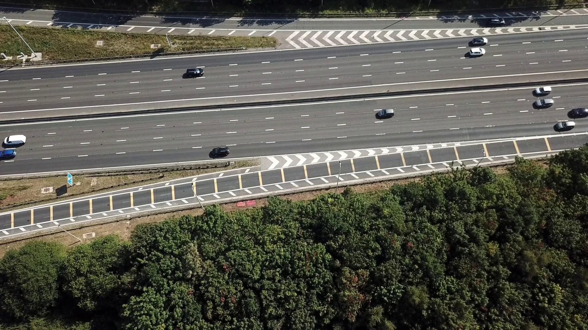
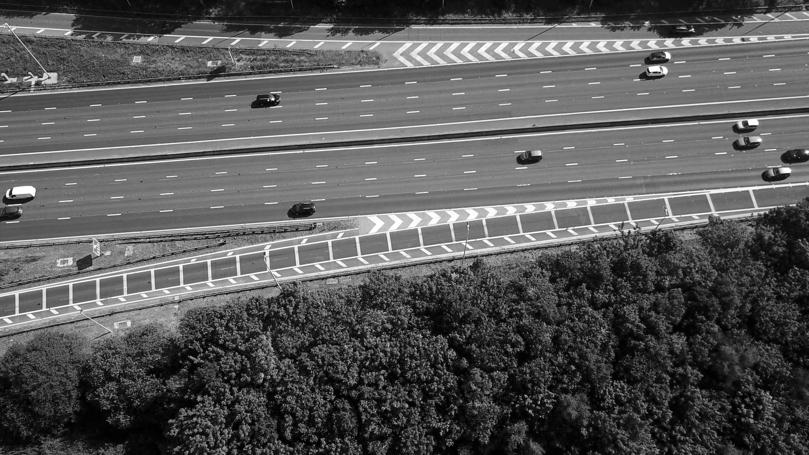
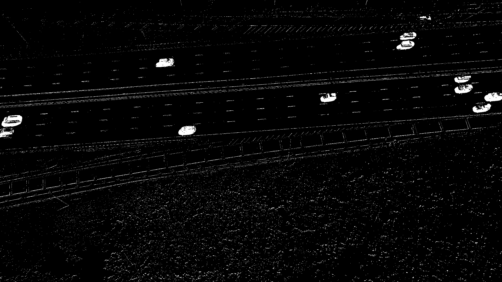
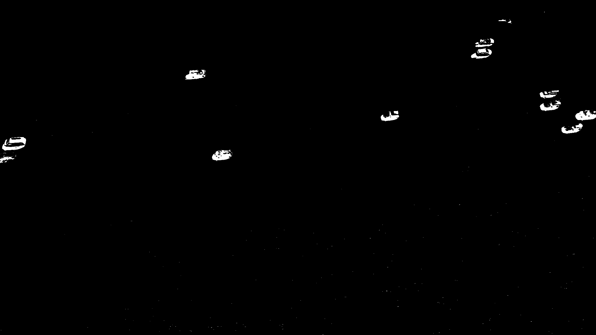
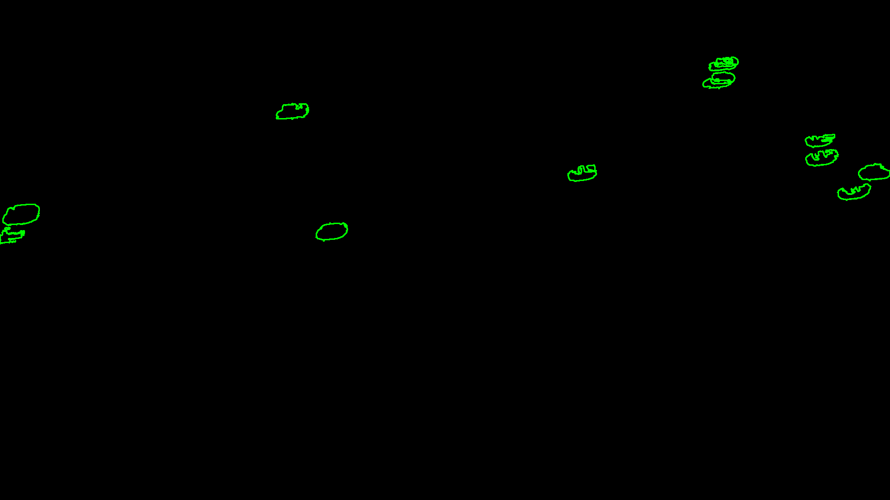
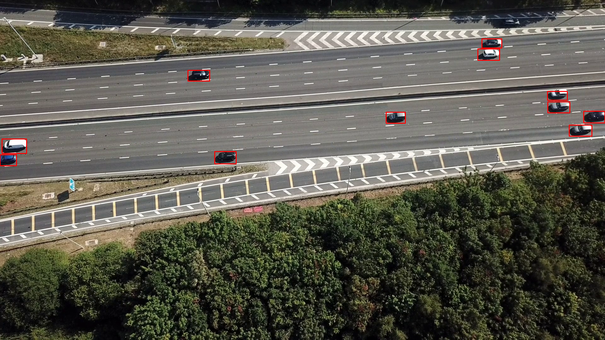

# Udacity-Cpp-Nanodegree-Capstone-Project
A high-performance C++ application for real-time vehicle detection using OpenCV's background subtraction and contour analysis techniques. This project was developed as a Capstone final project for the Udacity C++ Nanodegree program.

<p align="center">
  
</p>

## Overview

This system processes video streams to detect and track vehicles in real-time using computer vision techniques. It employs MOG2 (Mixture of Gaussians) background subtraction, morphological operations for noise reduction, and contour detection to identify and track vehicles with bounding boxes.

## Features

- **Real-time Processing**: Multi-threaded architecture with separate reader and worker threads for optimal performance
- **Background Subtraction**: MOG2 algorithm for robust foreground detection
- **Morphological Refinement**: Noise reduction and object enhancement using erosion and closing operations
- **Contour Detection**: Automatic vehicle identification with configurable minimum area threshold
- **Feature Extraction**: Computes bounding boxes, centroids, areas, aspect ratios, and fill ratios
- **Performance Logging**: CSV logging of frame-by-frame statistics (frame number, object count, FPS)
- **Configurable Parameters**: External configuration file for easy tuning without recompilation

## Pipeline Visualization

The system processes frames through multiple stages:

<p align="center">
<table align="center">
<tr>
<th>Original</th>
<th>Grayscale</th>
<th>Foreground</th>
</tr>
<tr>
<td></td>
<td></td>
<td></td>
</tr>
<tr>
<th>Refined</th>
<th>Contours</th>
<th>Detections</th>
</tr>
<tr>
<td></td>
<td></td>
<td></td>
</tr>
</table>
</p>

## Requirements

- **C++ Compiler**: C++17 support required
- **CMake**: Version 3.10 or higher
- **OpenCV**: Version 4.0 or higher
- **Threading**: Included in standard library

## Installation

### Clone the Repository

```bash
git clone https://github.com/abdullaxahmed/Udacity-Cpp-Nanodegree-Capstone-Project.git
cd Udacity-Cpp-Nanodegree-Capstone-Project
```

### Build Instructions

```bash
mkdir build
cd build
cmake ..
make
```

## Running the project


```bash
./car-tracker
```

The application will:
1. Load parameters from `../config/parameters.txt`
2. Open the video file specified in the configuration
3. Process frames and display detections in real-time
4. Log statistics to the specified CSV file
5. Press **ESC** to exit


### Project Structure

```
Udacity-Cpp-Nanodegree-Capstone-Project/
├── src/
│   ├── main.cpp              # Application entry point
│   ├── video_processing.cpp  # Video I/O and threading
│   ├── video_processing.h
│   ├── detector.cpp          # Detection algorithms
│   ├── detector.h
│   ├── display.cpp           # Visualization
│   ├── display.h
│   ├── config_io.cpp         # Configuration and logging
│   └── config_io.h
├── config/
│   └── parameters.txt        # Configurable parameters
├── logs/
│   └── run_log.csv           # Output information
├── images/                   # Process and demo images
│       ├── frame_original.png
│       ├── frame_gray.png
│       ├── frame_foreground.png
│       ├── frame_refined.png
│       ├── frame_contours.png
│       └── frame_bounding_boxes.png
├── videos/
│   └── highway.mp4           # Sample input video
├── CMakeLists.txt
└── README.md
```

### Configuration

Edit `config/parameters.txt` to customize behavior:

```
video=../videos/highway.mp4
history=800
thresh=80.0
minarea=500.0
shadows=1
log=run_log.csv
```

**Parameters:**
- `video`: Path to input video file
- `history`: Number of frames for MOG2 background model (higher = more stable, slower adaptation)
- `thresh`: Variance threshold for MOG2 (lower = more sensitive)
- `minarea`: Minimum contour area to filter noise (pixels²)
- `shadows`: Enable/disable shadow detection (1=true, 0=false)
- `log`: Output CSV file path for performance metrics

### Output

The application generates a CSV log file with the following columns:
- `frame`: Frame number
- `objects`: Number of detected vehicles
- `fps`: Processing speed (frames per second)

Example output:
```csv
frame,objects,fps
0,5,42.3
1,6,43.1
2,5,41.8
```

## Architecture

### Class Design

- **VideoReader**: Manages video capture and frame buffering
- **ColorConverter**: Handles BGR to grayscale conversion
- **Segmentation**: Implements MOG2 background subtraction and mask refinement
- **ContourDetection**: Detects and filters contours based on area
- **ContourFeatures**: Extracts geometric features from contours
- **Display**: Renders bounding boxes and manages visualization
- **Logger**: Handles CSV file output for performance tracking
- **FpsMeter**: Real-time FPS calculation

### Threading Model

The concurrent processing model uses two threads:

1. **Reader Thread**: Continuously captures frames from video source
2. **Worker Thread**: Processes frames through the detection pipeline

This design ensures smooth video playback and maximizes CPU utilization.

## Algorithm Details

### Background Subtraction (MOG2)

The system uses OpenCV's MOG2 algorithm, which models each pixel as a mixture of Gaussians. This approach is robust to gradual lighting changes and handles shadows effectively.

### Mask Refinement

Two morphological operations improve detection quality:
1. **Closing**: Fills small holes and connects nearby regions (cross kernel, 3×3)
2. **Erosion**: Removes small noise points (cross kernel, 3×3)

### Feature Extraction

For each detected vehicle, the system computes:
- **Bounding Box**: Smallest rectangle enclosing the contour
- **Centroid**: Center of mass using image moments
- **Area**: Pixel count within contour
- **Aspect Ratio**: Width/height of bounding box
- **Fill Ratio**: Contour area / bounding box area


## Udacity C++ Nanodegree Requirements

This project demonstrates the following C++ concepts covered in the nanodegree:

### Object-Oriented Programming
- Multiple classes with clear responsibilities and encapsulation
- Proper use of constructors, destructors, and member functions
- Access specifiers (public/private) for data hiding

### Memory Management
- Smart pointers (`std::shared_ptr`) for automatic memory management
- Rule of Five implementation in `Segmentation` class
- Move semantics for efficient resource transfer
- RAII principles (e.g., file handles in `Logger`)

### Concurrency
- Multi-threaded video processing with reader/worker pattern
- Mutex-based synchronization for shared frame buffer
- Futures and promises for result communication

### Modern C++ Features
- C++17 standard compliance
- Lambda expressions for contour filtering
- Range-based for loops
- Auto type deduction
- Move semantics


## License

This project is released under the MIT License.

## References

This project was built using knowledge from the Udacity C++ Nanodegree Program and OpenCV documentation.


### OpenCV Documentation

**Core Functions:**
- [cv::VideoCapture](https://docs.opencv.org/4.x/d8/dfe/classcv_1_1VideoCapture.html) - Video file reading and frame capture
- [cv::cvtColor](https://docs.opencv.org/4.x/d8/d01/group__imgproc__color__conversions.html#ga397ae87e1288a81d2363b61574eb8cab) - Color space conversion (BGR to grayscale)
- [cv::BackgroundSubtractorMOG2](https://docs.opencv.org/4.x/d7/d7b/classcv_1_1BackgroundSubtractorMOG2.html) - Gaussian mixture-based background/foreground segmentation
- [cv::createBackgroundSubtractorMOG2](https://docs.opencv.org/4.x/de/de1/group__video__motion.html#ga2beb2dee7a073809ccec60f145b6b29c) - MOG2 algorithm initialization

**Morphological Operations:**
- [cv::getStructuringElement](https://docs.opencv.org/4.x/d4/d86/group__imgproc__filter.html#gac342a1bb6eabf6f55c803b09268e36dc) - Create structuring elements for morphology
- [cv::morphologyEx](https://docs.opencv.org/4.x/d4/d86/group__imgproc__filter.html#ga67493776e3ad1a3df63883829375201f) - Advanced morphological transformations (closing)
- [cv::erode](https://docs.opencv.org/4.x/d4/d86/group__imgproc__filter.html#gaeb1e0c1033e3f6b891a25d0511362aeb) - Erosion operation

**Contour Analysis:**
- [cv::findContours](https://docs.opencv.org/4.x/d3/dc0/group__imgproc__shape.html#gadf1ad6a0b82947fa1fe3c3d497f260e0) - Detect contours in binary images
- [cv::drawContours](https://docs.opencv.org/4.x/d6/d6e/group__imgproc__draw.html#ga746c0625f1781f1ffc9056259103edbc) - Draw contour outlines
- [cv::contourArea](https://docs.opencv.org/4.x/d3/dc0/group__imgproc__shape.html#ga2c759ed9f497d4a618048a2f56dc97f1) - Calculate contour area
- [cv::boundingRect](https://docs.opencv.org/4.x/d3/dc0/group__imgproc__shape.html#ga103fcbda2f540f3ef1c042d6a9b35ac7) - Compute bounding rectangle
- [cv::moments](https://docs.opencv.org/4.x/d3/dc0/group__imgproc__shape.html#ga556a180f43cab22649c23ada36a8a139) - Calculate image moments for centroid computation

**Display Functions:**
- [cv::imshow](https://docs.opencv.org/4.x/d7/dfc/group__highgui.html#ga453d42fe4cb60e5723281a89973ee563) - Display images in windows
- [cv::waitKey](https://docs.opencv.org/4.x/d7/dfc/group__highgui.html#ga5628525ad33f52eab17feebcfba38bd7) - Wait for keyboard input
- [cv::rectangle](https://docs.opencv.org/4.x/d6/d6e/group__imgproc__draw.html#ga07d2f74cadcf8e305e810ce8eed13bc9) - Draw rectangles (bounding boxes)
- [cv::destroyAllWindows](https://docs.opencv.org/4.x/d7/dfc/group__highgui.html#ga6b7fc1c1a8960438156912027b38f481) - Close all OpenCV windows